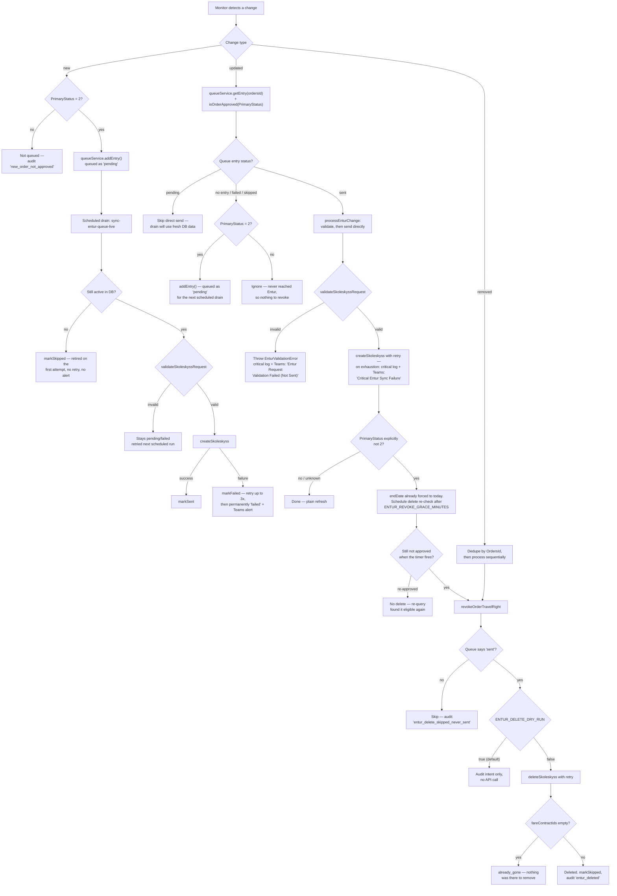

# Entur Skoleskyss Integration

This project integrates with Entur Skoleskyss using OAuth2 client credentials and a typed service layer.

## Required Environment Variables

```env
ENTUR_AUDIENCE=your_audience
ENTUR_CLIENT_ID=your_client_id
ENTUR_CLIENT_SECRET=your_client_secret
ENTUR_TOKEN_URL=https://<token-host>/oauth/token
ENTUR_API_URL=https://api.staging.entur.io/skoleskyss

# Deletion (optional — see "Deleting a travel right")
ENTUR_DELETE_DRY_RUN=true        # default true; set to "false" to actually delete
ENTUR_REVOKE_GRACE_MINUTES=15    # default 15; delay before a lost-approval delete re-check
```

The integration fails fast on startup if any of these are missing.

## Implemented Services

### `EnturAuthClient` (`src/services/entur-auth.service.ts`)

- Gets OAuth2 token with `client_credentials`
- Caches token until shortly before expiry
- Sends authenticated HTTP requests
- Exposes:
  - `testConnection()`
  - `getTokenInfo()`
  - `refreshToken()`

### `EnturApiService` (`src/services/entur-skoleskyss.service.ts`)

Implemented methods:

- `createSkoleskyss(request)`
- `createBatchSkoleskyss(requests)`
- `createSkoleskyssRequest(data)`
- `validateSkoleskyssRequest(request)`
- `deleteSkoleskyss(request)` — see [Deleting a travel right](#deleting-a-travel-right)
- `validateDeleteSkoleskyssRequest(request)`
- `testConnection()`
- `getTokenInfo()`
- `refreshToken()`

Not implemented in current code:

- `updateSkoleskyss(...)` — not needed: `POST /skoleskyss` is *"opprett eller oppdater"*, and Entur
  deduplicates on `studentId` (see [How Entur handles duplicate posts](#how-entur-handles-duplicate-posts))

## Request Shape

```typescript
interface PostSkoleskyssRequest {
  organisationId?: number;
  studentId: string | number;
  applicationId: string | number;
  validity: {
    startDate: string; // YYYY-MM-DD
    endDate: string;   // YYYY-MM-DD
    zones: Array<
      | { fromZoneId: string; toZoneId: string }
      | { groupOfTariffZoneId: string }
    >;
    calendar?: { id: string };   // from OrganisationFareContractConfig
    travelWindow?: {             // from OrganisationFareContractConfig.timeBands
      fromHour: number;
      toHour: number;
    };
  };
  studentDetails?: {
    firstName?: string;
    surname?: string;
    school?: {
      id: string | number;
      name: string;
    };
    class?: {
      id: string | number;
      name: string;
    };
    email?: string;
    phone?: {
      number: string;
      countryCode?: string;
    };
  };
}
```

`validity.calendar.id` and `validity.travelWindow` are populated automatically from [fare contract config](#fare-contract-config) and omitted from the payload when not set.

## Deleting a travel right

`DELETE /skoleskyss` (`removeSkoleskyss`) — *"Fjerner mottakeren fra skyssrettigheten."*

The travel right is identified by the **same `studentId` + `applicationId` pair used to create it,
sent in the request body**. There is no path parameter. An earlier `cancelSkoleskyss(externalRef)`
stub in this repo assumed a `/skoleskyss/{externalRef}` form that does not exist — `externalRef`
appears only in the *create response*, where it is Entur's echo of the ids we supplied, not a
separate addressable handle.

```typescript
interface DeleteSkoleskyssRequest {
  organisationId?: number;         // optional — Entur reads it from the token payload
  studentId: string | number;      // required
  applicationId: string | number;  // required
}

interface DeleteSkoleskyssResponse {
  customerAccountId: string;
  fareContractId?: string;
  fareContractIds?: string[];      // deprecated; holds 0 or 1 element
}
```

Because the body travels on a DELETE, `EnturAuthClient.apiRequest` serializes a body for every
method except `GET`.

**Errors:** `400` (validation issues / invalid calendar or zone), `401`, `403`, `500`, and `412`
when `organisationId` is missing from the token payload. The API defines no `404`.

### Observed behaviour (verified against staging, 5 Sep 2026)

A create → delete → delete-again round trip against `api.staging.entur.io`:

| Call | Result |
|---|---|
| `createSkoleskyss` | `200` — `{ recipient: { externalRef, customerAccountId }, fareContract: { externalRef, fareContractId, status: 'created' }, transferDetails: { pickupCode, expiresAt } }` |
| `deleteSkoleskyss`, right exists | `200` — `fareContractId` set, `fareContractIds: ["TEL:FareContract:…"]` |
| `deleteSkoleskyss`, **already deleted** | `200` — `fareContractIds: []` and **no `fareContractId`** |
| `deleteSkoleskyss`, **student unknown to Entur** | `500` — `{"error":"Internal"}` |

Two consequences for anyone wiring this up:

- **Delete is idempotent, and "already gone" is detectable** — not by status code, but by an empty
  `fareContractIds` / absent `fareContractId` in a `200` response. This matters because
  `makeHttpRequest` surfaces only a message string, never a status code, so the response body is
  the only signal available to a caller.
- **An unknown student is a `500`, not a `404`.** A delete for a student who has no Entur customer
  account is indistinguishable from a genuine server fault, so it must not be retried blindly.
### How deletion is wired

`revokeOrderTravelRight` (`src/services/entur-revoke.service.ts`) is the single entry point for every
delete, so behaviour cannot drift between triggers. It decides via `decideRevokeAction`
(`src/utils/revoke-decision.utils.ts`), calls `deleteSkoleskyss` with retry, retires the order's queue
entry to `skipped`, and audits the outcome.

| Trigger | Behaviour |
|---|---|
| `removed` change type | Revokes the order's contract. Processed **sequentially** and deduplicated by `OrdersId`, since a bulk change in the source system can drop a cohort in one poll. |
| `sent` order loses approval | **Two-stage.** `endDate = today` immediately (reversible), then a delete re-check after `ENTUR_REVOKE_GRACE_MINUTES`. |
| `npm run delete-entur` | Manual revoke for a student or a single order. Dry run unless `--dry-run false`. |

Two guards are load-bearing:

- **The never-sent gate.** Nothing is deleted unless the queue records the order as `sent` — this is
  what keeps us off the `500`-on-unknown-student path. `--force` overrides it for manual cleanup after
  a queue rebuild has wiped the send history.
- **`PrimaryStatus` must be explicitly non-approved.** `isOrderApproved` returns `false` for
  `undefined`/`null` too, so an absent status falls back to a plain refresh rather than a revoke.

Deletes are **dry run by default**. Set `ENTUR_DELETE_DRY_RUN=false` to arm them; anything else logs
and audits the intended delete without calling Entur. A mass delete is never blocked and raises no
Teams alert — it is either a human running the CLI or a genuine bulk change upstream — so the audit
log is the record of what happened.

## Fare Contract Config

**File:** `src/config/fare-contract-config.ts`

The full `OrganisationFareContractConfig` type (from Entur):

```typescript
type OrganisationFareContractConfig = {
  authorityId: string;
  name: string;
  timeBands?: { startTime: number; endTime: number };
  validableElementId: string;
  fareProductId: string;
  userProfileId: string;
  maximumNumberOfInterchanges?: number;
  calendarId: string;
  activationMeans: string[];
};
```

### Default config (from `.env`)

All default values are driven by environment variables so the system can be deployed for different counties without code changes:

| Env var | Purpose |
|---|---|
| `ENTUR_AUTHORITY_ID` | Authority identifier |
| `ENTUR_DEFAULT_CALENDAR_ID` | Default calendar (e.g. `TEL:FareDayType:SchoolDayDefaultSchool20252026`) |
| `ENTUR_DEFAULT_TIMEBANDS_START` | Default time band start hour (e.g. `5`) |
| `ENTUR_DEFAULT_TIMEBANDS_END` | Default time band end hour (e.g. `18`) |
| `ENTUR_VALIDABLE_ELEMENT_ID` | Validable element ID |
| `ENTUR_FARE_PRODUCT_ID` | Fare product ID |
| `ENTUR_USER_PROFILE_ID` | User profile ID |

`timeBands` is only included in the request when both start and end env vars are set.

### Per-school/class overrides

Edit `fareContractRules` in `src/config/fare-contract-config.ts` to override the default config for specific schools or classes. You can add as many independent rules as needed.

**Matching logic:**

- Rules are evaluated **top-to-bottom** — the **first matching rule wins**. Place more specific rules before more general ones.
- Within a rule, `schoolIds` and `classNamePatterns` use **AND logic**: if both are set, the student's school *and* class must both match.
- A rule with only `schoolIds` matches any class at those schools. A rule with only `classNamePatterns` matches that class pattern at any school.
- Students that match no rule receive the default config from `.env`.

```typescript
export const fareContractRules: FareContractRule[] = [
  // School 101 — all classes get a specific calendar
  {
    schoolIds: ['101'],
    config: { calendarId: 'TEL:FareDayType:SchoolDay101_20252026' },
  },

  // School 202 — all classes get a different calendar AND different time bands
  {
    schoolIds: ['202'],
    config: {
      calendarId: 'TEL:FareDayType:SchoolDay202_20252026',
      timeBands: { startTime: 6, endTime: 17 },
    },
  },

  // VG3 classes at school 303 specifically — AND logic (both must match)
  // This rule is more specific than a school-only or class-only rule, so put it first
  {
    schoolIds: ['303'],
    classNamePatterns: ['VG3'],
    config: { calendarId: 'TEL:FareDayType:SchoolDayVG3_303_20252026' },
  },

  // All VG3 classes at any school not already matched above
  {
    classNamePatterns: ['--TIP1'],
    config: { timeBands: { startTime: 6, endTime: 17 } },
  },
];
```

Each rule is fully independent — changing one rule has no effect on the others. A student is evaluated against each rule in order and assigned the first match's config merged on top of the default.

After editing rules, rebuild the project: `npm run build`.

## Queue Architecture

The sync queue decouples student detection from Entur API calls, allowing controlled rollout at any pace.

### Three roles

| Role | Process | Trigger |
|---|---|---|
| **Build** | `npm run sync-entur-queue-rebuild` | Once per school year (or on demand) |
| **Append** | `npm run monitor-orders` (long-running) | Continuous — new students detected in DB |
| **Drain** | `npm run sync-entur-queue-live` | Windows Task Scheduler (e.g. 09:00–15:00) |

### Dispatch decision (new / updated / removed)



**Only approved orders take a queue slot.** An order is typically created unapproved and decided
(approved or rejected) seconds later, so queueing it on creation would fill the queue — and the
per-run `SYNC_QUEUE_LIMIT` — with orders that may never be approved, each burning three drain
attempts before being retired. The monitor therefore skips unapproved new records, and it is the
*approving* update event that enqueues the order. The predicate is `isOrderApproved`
(`src/utils/order-status.utils.ts`), the same `PrimaryStatus = 2` rule `StudentService` applies.

An `updated` change only reaches Entur directly once the queue confirms it's safe to. If the
order's queue entry is still `pending`, it hasn't actually been created in Entur yet, so a direct
send here would race — or duplicate — the scheduled drain's own send, and the update is skipped in
favor of letting the drain pick up fresh DB data. If the order has never been sent (no entry, or a
terminal `failed`/`skipped` entry), an approval re-queues it and a non-approval is ignored outright
— nothing reached Entur, so there is nothing to revoke and nothing worth retrying. Only when the
entry is `sent` does the direct send proceed, and it proceeds **regardless of approval**: a `sent`
order that loses approval is sent again with `endDate` overridden to today.

That `endDate = today` rewrite is now **stage one of a two-stage revoke**, not the whole of it. It
stops travel immediately and is reversible, which matters for two reasons: `PrimaryStatus = 2` is the
only value documented anywhere, so "not 2" may cover benign states, and an order is typically created
unapproved and decided seconds later — deleting on the first poll would destroy and recreate a
pupil's contract on a transient flip. Stage two is a delete re-check scheduled
`ENTUR_REVOKE_GRACE_MINUTES` later (`src/services/deferred-revoke.service.ts`).

When that timer fires, `revokeAfterGracePeriod` re-queries the **database** via
`StudentService.getSingleStudent` — not the queue. This distinction is the whole guard: a re-approved
order keeps its `sent` queue entry, because `decideUpdateDispatchAction` dispatches it as a plain
`send` and never changes queue state. Only a fresh DB read can tell a genuine rejection from a
transient flip. `getSingleStudent` already filters to `PrimaryStatus = 2` and drops overridden
orders, so finding the order there means it is eligible again and the delete is cancelled. A lookup
that **throws** aborts without deleting — a failed query is not evidence that an order became
ineligible, and treating it as such would revoke valid cards for every pending check at once.

A cancelled revoke needs no repair: the re-approval is itself an `updated` change, which the monitor
sends normally, rewriting `endDate` back to the order's real value.

Pending checks live in memory only — a monitor restart drops them, leaving the order at
`endDate = today` with no delete, which is the safe direction to fail in. This logic lives in
`QueueService.getEntry()`
(`src/services/queue.service.ts`) and `decideUpdateDispatchAction`
(`src/utils/queue-dispatch-decision.utils.ts`).

### Queue file

Both the monitor and the scheduler share `queue/sync-queue.json` (path configurable via `SYNC_QUEUE_FILE`).

Each entry tracks: `studentId`, `ordersId`, `startDate`, `status`, `retryCount`, `addedAt`, `processedAt`.

**Status lifecycle:**
```
pending → sent        (scheduler processed successfully)
pending → pending     (scheduler failed, retryCount < maxRetries — retried next run)
pending → failed      (scheduler failed, retryCount >= maxRetries — permanently failed + Teams alert)
pending → skipped     (order no longer active in DB — retired on the FIRST attempt, no retry, no alert)
failed  → pending     (monitor re-queues via addEntry if the order becomes approved again)
skipped → pending     (same — a re-approved order comes back into play)
```

`failed` and `skipped` are both terminal, but they mean different things: `failed` is "we tried to
send this and it went wrong", `skipped` is "this order is no longer eligible, so sending it is not
something we should attempt". Retries cannot make a rejected order active again, so retrying would
only occupy a queue slot for three scheduled runs and raise a permanent-failure alert for what is a
routine rejection. The one exception that still alerts is `student_not_found` — also retired
immediately, since retries won't bring the student back, but unexpected enough to be worth knowing.

### Downtime recovery

`CustomQueryMonitor` establishes a silent baseline on first poll — records present in the DB at startup are not emitted as `NEW_RECORDS`. This means students added while the monitor was down would normally be missed.

The monitor handles this with a **startup reconciliation**: before `startMonitoring()` begins, it runs the same SQL query once via `getCurrentResults()` and calls `addEntry()` for every approved DB record not already in the queue as `pending` or `sent`. Unapproved records are skipped, exactly as on the live path. The reconciliation log shows how many entries were added, how many were skipped as not approved, and how many records were checked.

### What goes through the queue vs. direct

| Change type | Handling |
|---|---|
| New student order, approved (`PrimaryStatus = 2`) | Added to queue → sent by scheduler in next batch |
| New student order, not yet approved | Not queued — audit logged only; the approving update event queues it |
| Updated student order | Direct Entur call (immediate) only when the queue entry is `sent`; otherwise queued or ignored (see the dispatch decision diagram above) |
| Removed student order | `deleteSkoleskyss` for that order, if the queue records it as `sent`. Sequential, deduplicated by `OrdersId`, dry run unless `ENTUR_DELETE_DRY_RUN=false` |

### Entry dedup rules (`addEntry`)

- `pending` or `sent` → skip (no duplicate)
- `failed` or `skipped` → reset to `pending`, clear error, re-queue
- Not found → add as new `pending` entry

---

## How Entur handles duplicate posts

**Entur deduplicates on `studentId` and always honours the newest order posted.** Confirmed
with Entur, 5 Sep 2026.

This matters, because the queue and dispatch-decision logic above is built around *avoiding*
duplicate sends and can read as though a duplicate were dangerous. It is not:

- **Re-sending is safe.** Sending a student's order again overwrites their existing contract
  with the same data. Where recovery is needed — a lost queue file, drift after monitor
  downtime, an uncertain partial run — a full re-send (`npm run sync-entur-live-all`) is a
  legitimate repair, not a risk. The queue's dedup rules exist to avoid pointless API traffic
  and racing the scheduler, not to prevent corruption.
- **But send order carries meaning.** Last post wins per student, so if more than one order
  for the same student is posted in a single run, the last one silently becomes their
  contract. Two consequences are built into the code:
  - `syncFromQueue` sends only the order its queue entry refers to, never the student's other
    orders (`selectQueuedOrder` in `src/utils/queued-order-selection.utils.ts`).
  - The student queries sort `ORDER BY o.ToDate ASC`, so where a student does have more than
    one order in one batch, the longest-running contract is posted last and wins.

---

## Validation Rules

`validateSkoleskyssRequest` checks:

- Required fields: `studentId`, `applicationId`, `validity`, `studentDetails.phone.number`
- Date format: `YYYY-MM-DD`
- Date logic: `endDate >= startDate`
- At least one `zones` entry
- Zone format correctness
- Basic email format (if set)
- Phone number is required: `studentDetails.phone.number` must be present (Entur/skoleskyss requires being able to reach the student/guardian); format: digits only, no spaces/hyphens/country code embedded in `number`; when `countryCode` is `+47` or omitted, `number` must be exactly 8 digits starting with `4` or `9`; `countryCode` itself must be an optional `+` followed by 1-3 digits

`validity.calendar` and `validity.travelWindow` are not validated — they are optional and Entur handles absent values gracefully.

### Validation on the monitor's direct-send path

`validateSkoleskyssRequest` isn't only used by `--validate`/`sync-manager.ts` — the monitor's
direct-send path (`processEnturChange` in `src/monitor-student-orders.ts`) calls it too, right
before `createSkoleskyss` and outside the retry loop (retrying a validation failure would just fail
identically every time). If validation fails, the request is never sent — instead an
`EnturValidationError` is thrown, logged as a critical-log event `entur_validation_failed_skipped`,
and alerted to Teams under the title `"Entur Request Validation Failed (Not Sent)"`, distinct from
the `entur_process_failed_after_retries` / `"Critical Entur Sync Failure"` alert used when
`createSkoleskyss` itself fails after retries are exhausted.

This exists because `mapStudentRecordToEnturRequest`'s `overrideEndDateWhenPrimaryStatusNot2`
option (`src/utils/entur-request-mapper.utils.ts`, used by the monitor for every direct-send
mapping) forces `endDate` to today's date whenever `PrimaryStatus != 2`. If the order's `StartDate`
is still in the future, this produces `endDate < startDate` — an invalid request that would
otherwise reach Entur's API directly and cause an internal server error there.

## Useful Commands

PowerShell note: use an extra separator when passing flags: `npm run <script> -- -- <flags>`

```bash
# Test Entur authentication
npm run test-entur

# Dry-run sync (default)
npm run sync-entur

# Queue mode — send next 10 students (dry run)
npm run sync-entur-queue

# Queue mode — send next 10 students (live)
npm run sync-entur-queue-live

# Rebuild queue from DB (dry run, useful at start of school year)
npm run sync-entur-queue-rebuild

# PowerShell-friendly aliases
npm run sync-entur-live-all
npm run sync-entur-dry-all

# Sync a specific student
npm run sync-entur -- -- --method single --student-id "81722"

# Sync multiple students
npm run sync-entur -- -- --method single --student-ids "81722,12345,77793"

# Validate all sync methods
npm run sync-entur -- -- --validate

# Revoke a student's Entur contracts (dry run by default)
npm run delete-entur -- -- --student-id 91703

# Revoke one specific order, for real
npm run delete-entur -- -- --student-id 91703 --order-id 78411 --dry-run false

# Revoke even when the queue has no record of the send (e.g. after a queue rebuild)
npm run delete-entur -- -- --student-id 91703 --dry-run false --force

# Run tests
npm test
```

## Notes

- Sync runs with dry-run enabled by default.
- `groupOfTariffZoneId` used in this project: `TEL:GroupOfTariffZones:1`
- `syncMultipleStudents` reuses the single-student flow and aggregates results.
- Duplicate IDs are de-duplicated before processing.
- In staging (`ENTUR_AUDIENCE` contains `"staging"`), student details are replaced with Harry Potter 🧙 mock data.
